# Delivery insights
## Project presentation:
This project aims to analyse accidents in UK based on this [dataset](https://www.kaggle.com/tsiaras/uk-road-safety-accidents-and-vehicles?select=Accident_Information.csv)
and creating some insights in your desired folder.
In this project, 4 pipelines were created: Extract, transform, load and visualise.

## Tools chosen
- Python 3.8: Supportive community, Easy to use, Many librairies and Frameworks, Usage for Big data and Data science...
- Packages:\
-- kaggle: Communicate with kaggle API\
-- pandas: Datasets manipulation\
-- psycopg2, sqlalchemy: Communication with postgresql  
-- matplotlib, seaborn, squarify: Insights creation\
-- pre-commit, flake8, black, interrogate: Code quality practices\
-- pytest: Testing

## Requirements:
(On Windows) To use this package, you need:
- Download your kaggle token from Kaggle and move it to 'C:\Users\Windows_username\\.kaggle\kaggle.json'
- Have a postgresql installed and create database.ini file with this format
````
[postgresql]
host=HOST
database=DB
user=USER
password=PWD
````

## Usage
To use package, you need to generate wheeel and install it:
````
python setup.py bdist_wheel
pip install dist/delivery_insights-0.0.1-py3-none-any.whl
````
When you install it, you can use it by command or import it in your code to re-write functions, i.e transform functions.

## Project pipelines:
- Run all package pipelines:
````
 delivery_insights --output-folder OUTPUT_FOLDER --db-config-file DB_CONFIG_FILE
````
- Run Extract pipeline: extraction of dataset from Kaggle.
````
extract_pipeline --repo REPO_NAME --files-list FILES_LIST --output-folder OUTPUT_FOLDER
````
- Run Transform pipeline: data transformation to load and visualize later.
````
transform_pipeline --repo REPO_NAME --files-list FILES_LIST --output-folder OUTPUT_FOLDER
````
- Run Load pipeline: data load into postgresql table.
````
load_pipeline --input-folder INPUT_FOLDER --filename FILENAME --db-config-file DB_CONFIG_FILE
````
- Run Visualize pipeline: creation of insights to analyze the problem.
````
visualize_pipeline --input-folder INPUT_FOLDER --filename FILENAME --output-folder OUTPUT_FOLDER
````
## Disclaimer
To run multiple pipelines, you can create a bash file and put all commands above.

## Insights
When visualize pipeline run, you will get the list of insights below (you will find under insights folder):
- Accidents_per_months.png:
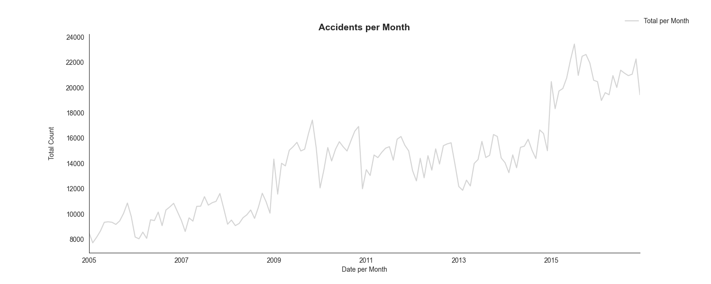
- Accidents_severity_share.png:
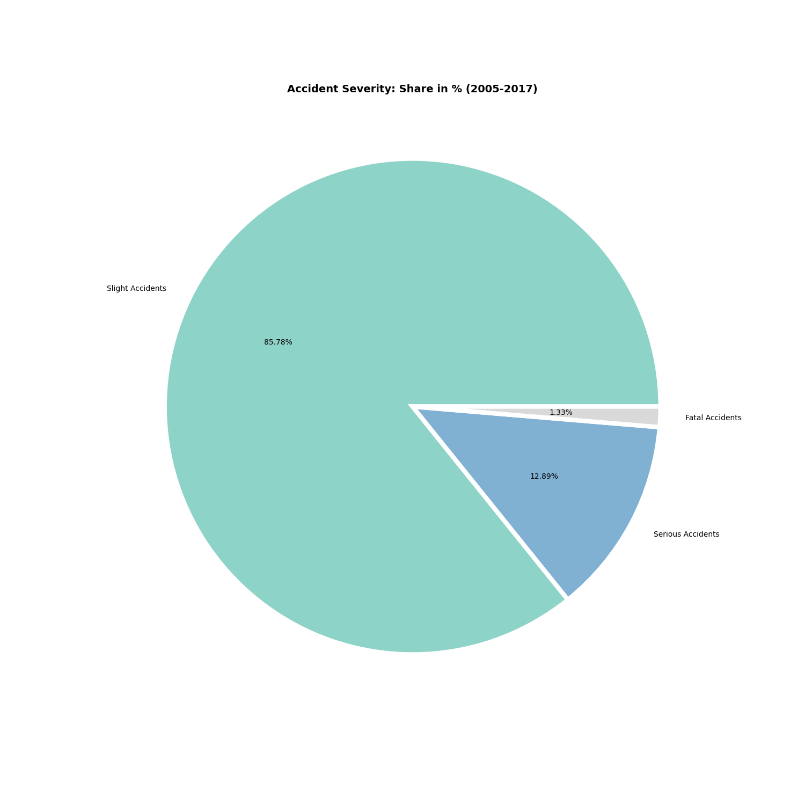
- Accidents_weather_conditions_share.png:
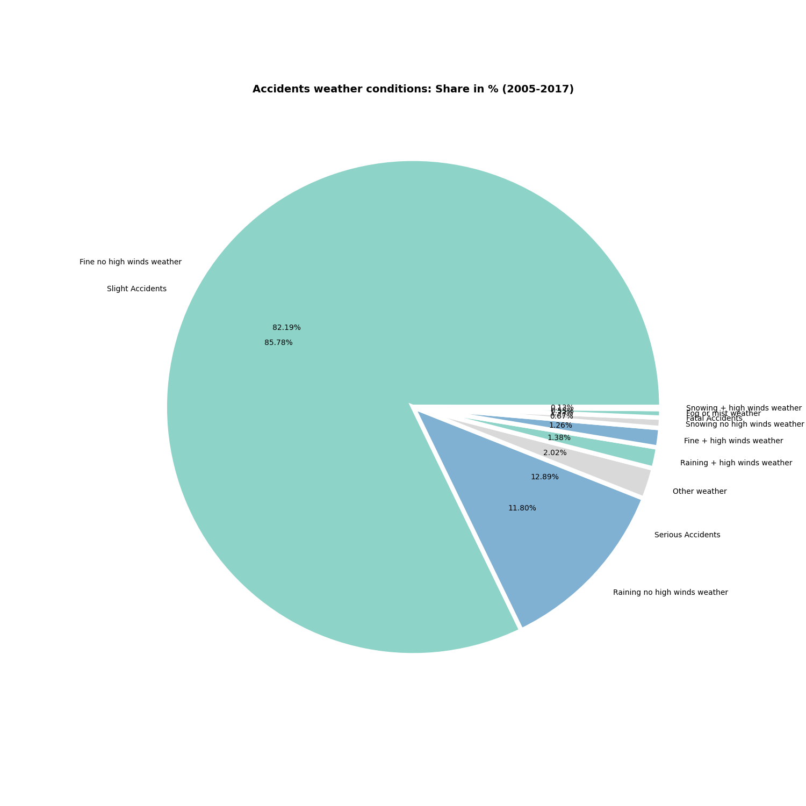
- accidents_by_age_and_sex.png:
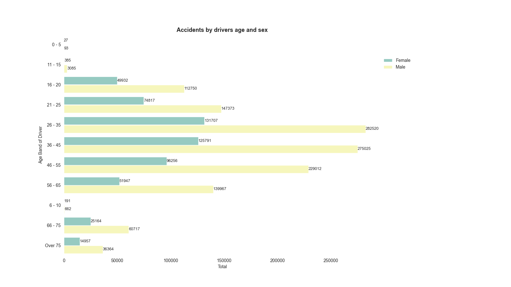
- accidents_by_drivers_age_and_vehicles_age.png:
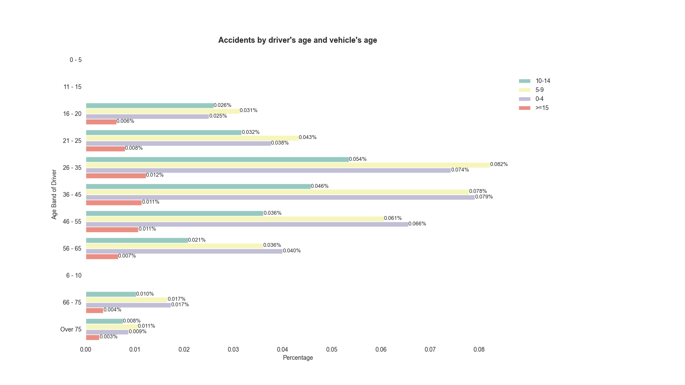

- accidents_by_home_area.png:
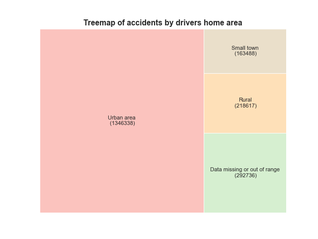

- accidents_by_journey_purpose.png:
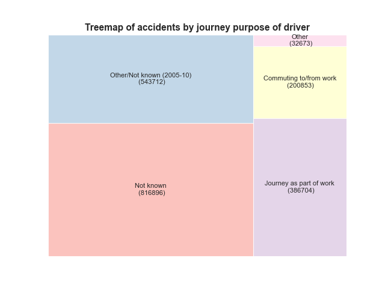

- accidents_by_manoeuver.png:
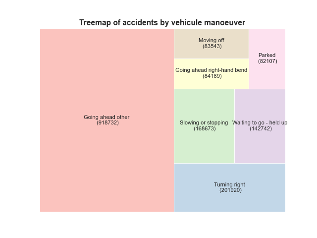

- accidents_per_Hour.png:
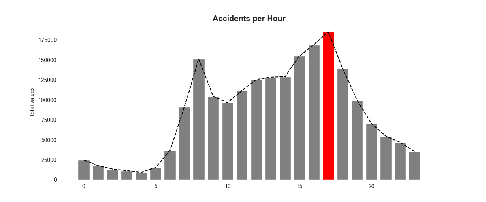

- accidents_per_daytime.png:
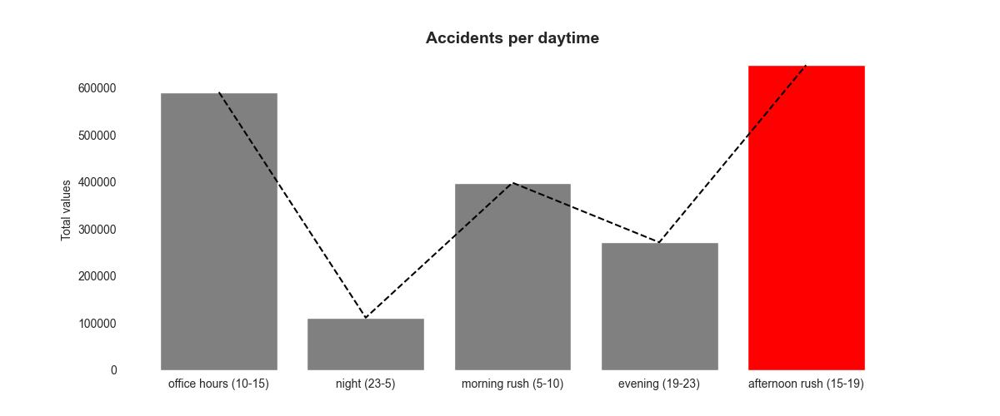

- accidents_per_weekday_and_year.png:
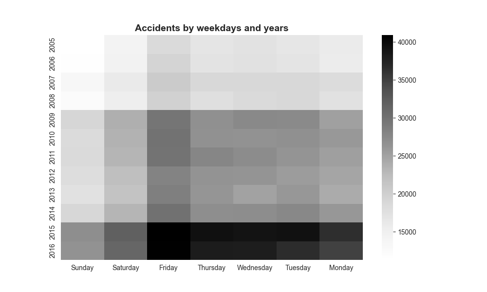

- accidents_per_year.png:
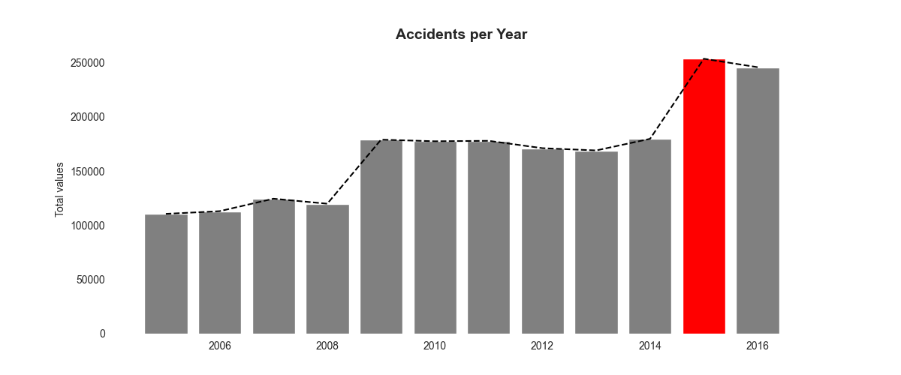

- daytime_accidents_by_severity.png:
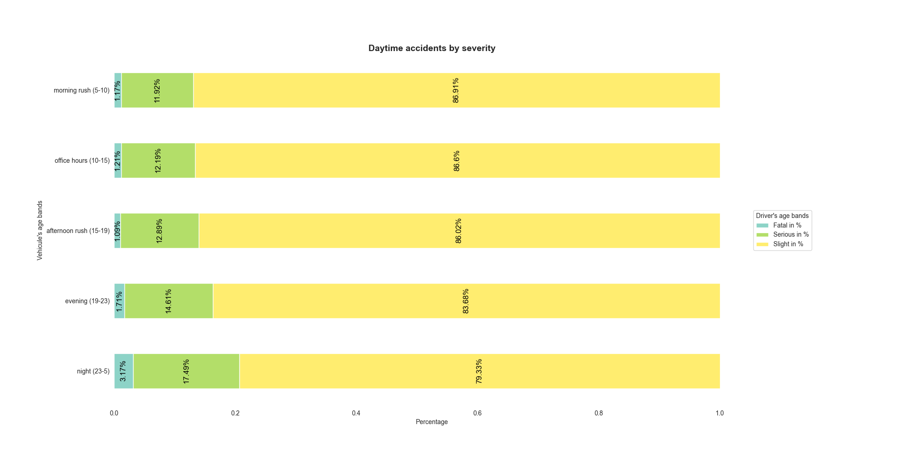

- fatalities_over_weeks.png:
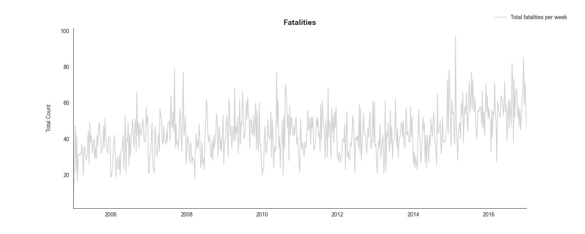

- vehicules_age_bands_accidents_by_drivers_age.png:
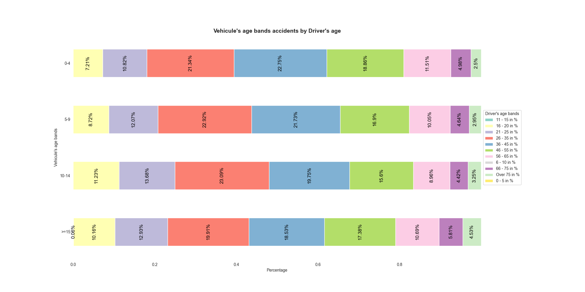